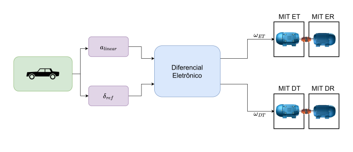
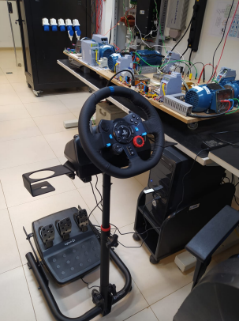
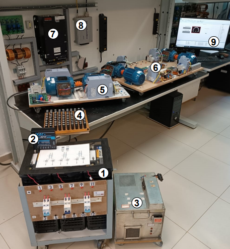

<h1 align="center">
    Bancada diferencial eletrônico
</h1>

    Modelagem do diferencial eletronico e aplicação na bancada de motores de indução trifásico  
    Discplina 1800318 - Laboratório de Projetos de Engenharia (2024)  
    USP, São Carlos

## 📝 Resumo

Este projeto contempla a idealização,o desenvolvimento, a aplicação e análise do diferencial eletrônico em uma bancada de motores de indução trifásicos (MIT) que simulam a tração e a resistência de veículo híbrido de topologia série. É idealizado o controle de velocidade de cada roda separadamente através das variáveis do sistema, o desenvolvimento será feito no software MATLAB/Simulink assim como as simulações, será introduzido a conexão com a plataforma dSPACE para a visualização do resultado do projeto nos MIT produzindo os resultados que serão discutidos.

## 📃 Introdução

Visando auxiliar principalmente extracurriculares na EESC/USP que têm como objeto principal de trabalho um carro elétrico (de qualquer topologia), este projeto é proposto para um sistema de controle nos automóveis movido à matrizes energéticas: o diferencial eletrônico. Por sua vez, este é baseado no diferencial mecânico, sistema de controle em automóveis movido à queima de combustível, no entanto, com a chegada dos veículos elétricos - que apresentam melhor eficiência em todos os aspectos - a indústria automotiva recorre à sistemas eletricamente implementados devido às inúmeras vantagens.  

Nos veículos à combustão convencionais, o diferencial mecânico é o mecanismo que consiste em um conjunto de engrenagens com a função de aplicar o mesmo torque em ambas as rodas de tracção, permitindo, também, que assumam diferentes velocidades por razõees de equilíbrio e estabilidade. As principais desvantagens desse sistema sao as perdas de fricção e a impossibilidade de controlar o torque das rodas de forma independente, além de ser inviável para as demandas dos veículos elétricos em geral. Nesse sentido, é proposto a idealização do diferencial eletrônico - mecanismo de controle dos sinais de torque e/ou velocidade angular nos motores elétricos - para ser implementado em veículos elétricos melhorando a estabilidade, reduzindo gastos e aumentando a eficiência das matrizes energeticas. 

## 🎯 Objetivos

Este projeto é idealizado nos principais objetivos descritos abaixo:
- Aprendizagem Matlab/Simulink e dSPACE - conceitos básicos;
- Estudo e modelagem do diferencial eletrônico;
- Aplicação do projeto na bancada MIT e;
- Adequação da bancada MIT para utilizar o controle joystick/pedais juntamente com o diferencial eletrônico.

## ⚙️ Descrição e metodologia do objeto

Este projeto é baseado na grande inserção dos veículos elétricos. Justificamos o seu desenvolvimento pela melhoria na dinâmica de direção, aumento de segurança, eficiência e desempenho energético, avanço na tecnologia e potencialidade para aplicações futuras. Em suma, o controle de tração nas rodas do veículo não pode ser o mesmo devido à perca de estabilidade que é causada e entre outros efeitos, dessa forma, a analogia do diferencial eletrônico é baseado na diferença de tração enviadas como sinal para os motores do veículo. O sinal de referência dependerá da curva realizada e a direção para onde é realizada, acarretando na diferença de velocidade das rodas. Na Figura 01 é desenhado o diagrama de blocos para o diferencial eletrônico, idealizado a partir das referências consultadas. 

  

  Figura 1: Diagrama de bloco do diferencial eletrônico

Na Figura 02, temos o volante joystick juntamente com os aceleradores para o controle manual na simulação de um veículo com a apliação dos resultados na bancada MIT mostrada na Figura 03.

  

  Figura 2:  Volante joystick e aceleradores para controle manual

 

  

  Figura 3: Bancada completa   1) Banco de seis bateriais de chumbo 12 V, 60 Ah   2) Carregador das baterias de chumbo 12 V, 10 A   3) Fonte CC, 60 W, 2000 W   4) Conjunto de capacitores eletrolíticos para emular um banco de UCs, 100 V (máx), 0,1 F   5) Subsistema de geração   6) Subsistema de tração e resistência veicular   7) Conversores CC-CC   8) Plataforma dSPACE HIL (MicroAutoBoxII)   9) Interface com a plataforma dSPACE

## ⚡ Plano de trabalho

1. Conhecimento de softwares, plataformas e laboratório para o trabalho;
2. Modelagem do diferencial eletrônico e realização de simulações no Simulink;
3. Aplicação do diferencial eletrônico na bancada MIT através do dSPACE e;
4. Aplicação do joystick/pedais na bancada MIT para simular um veículo.

### 📅 Cronograma
- 13/09: Apresentação do cronograma feito em Excel;
- 20/09: Reunião (na Sasel) para atividades no Simulink em grupo;
- 27/09 a 04/10: Estudos (através da literatura) sobre o diferencial eletrônico;
- 11/10: Função transferência
- 18/10 e 25/10: Simulações no laboratório;
- 01/11: Discussão dos resultados e;
- 08/11 a ...: Avaliação dos resultados (mudanças e novas simulações, se necessário) para o projeto final. 